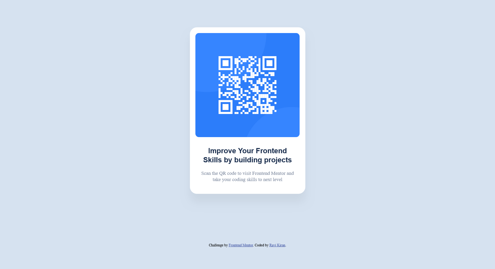

# Frontend Mentor - QR code component solution

This is a solution to the [QR code component challenge on Frontend Mentor](https://www.frontendmentor.io/challenges/qr-code-component-iux_sIO_H). Frontend Mentor challenges help you improve your coding skills by building realistic projects. 

## Table of contents

- [Overview](#overview)
  - [Screenshot](#screenshot)
  - [Links](#links)
- [My process](#my-process)
  - [Built with](#built-with)
  - [What I learned](#what-i-learned)
  - [Useful resources](#useful-resources)
- [Author](#author)
- [Acknowledgments](#acknowledgments)

## Overview

The purpose of this project is to create a simple web page that generates a QR code, providing users with a convenient way to access a specific resource or website.

### Screenshot

### Links

- Solution URL: [Add solution URL here](https://your-solution-url.com)
- Live Site URL: [Add live site URL here](https://your-live-site-url.com)

## My process

### Built with

- Semantic HTML5 markup
- CSS custom properties -boarder Box sizing
- CSS Grid
- Mobile-first approach

### What I learned

I have developed a simple HTML page for displaying a QR code. Here's what I have learned or implemented through this development:

###### HTML Structure:
- I have structured your HTML using `<html>`, `<head>`, and `<body>` tags, which is the basic skeleton of any HTML document.

###### Meta Tags:
- I have utilized `<meta>` tags for specifying character set (`<meta charset="utf-8">`) and viewport settings (`<meta name="viewport" content="width=device-width, initial-scale=1">`). This helps in ensuring proper rendering and responsiveness across different devices.

###### CSS Styling:
- I have defined CSS rules to style various elements within your HTML document.
- I have used CSS Grid (`display: grid;`) and `place-items: center;` to center the content vertically and horizontally on the page.
- Applied styling to the QR code container, including background color, padding, border radius, box shadow, etc.
- Styled the `
`, ``, and `<h1>` elements with appropriate font sizes, colors, margins, and alignments.
- Added a class for attribution styling.

###### QR Code Image:
- I have embedded a QR code image `` within your HTML, with a placeholder source (`src`). This QR code likely links to a website or resource related to frontend development.

###### Content:
- I have included a heading `<h1>` and a paragraph `
` providing information about the QR code's purpose, encouraging users to scan it to visit Frontend Mentor for improving their frontend coding skills.

Overall, through this development, I have practiced HTML structure, meta tags usage, CSS styling, and integrating external content (the QR code image) into your web page. Additionally, I have learned about the importance of frontend projects in improving coding skills.

### Useful resources

- [w3schools](https://www.w3schools.com) - This helped me for styling reason.
- [geeksforgeeks](https://www.geeksforgeeks.org/) -I'd recommend it to anyone to learn this concept.

## Author

- Website - [Ravi Kiran](https://www.your-site.com)
- Frontend Mentor - [@ravikiranvanguri07](https://www.frontendmentor.io/profile/ravikiranvanguri07)

## Acknowledgments

I have referred to tutorials, documentation, or online resources while developing this project.
